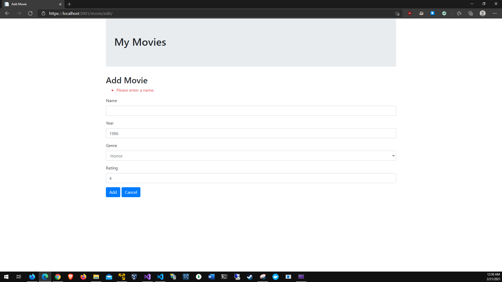

# Chapter 5 Movie List Debugging
# Application running:

# Fixed the "Add New Movie exception & handled the null exception for the movie field"

# Confirmed the correction of the exceptions by adding a test film

