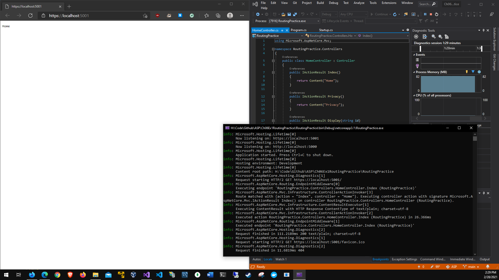

# Chapter 6 Routing Practice
# Application running:

# Index

# Home

# Privacy

# liftOff

# Countdown without value

# Countdown with value

# Countdown with routing

# Display

# Display/abc123

# missing second segment

# Segment value 5

# Segment not changed

# Segment change id to num
