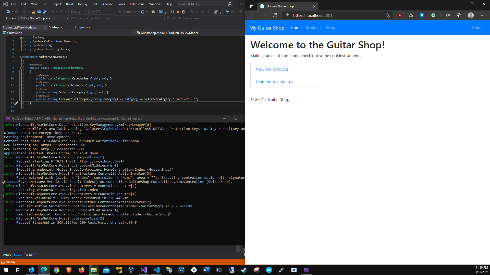

# Chapter 8 data transfer from controllers
# Application running:

# Product List Default

# Product List Admin (default)

# Product List Modified

# Product List Admin Modified

# Add Prompt

# Added Product

# Update prompt

# Updated Product

