# Chapter 11 validation

# Application running:
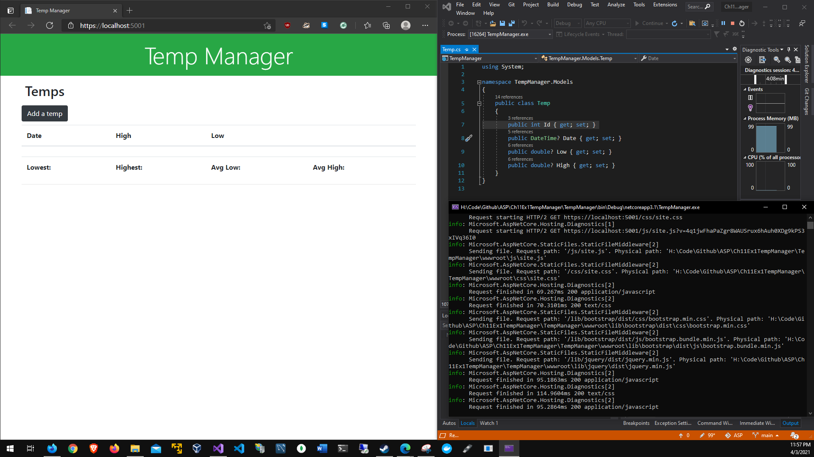
# Add temporary data with no data validation:

# Added temporary data with no data validation:

# Added blank data without validation:
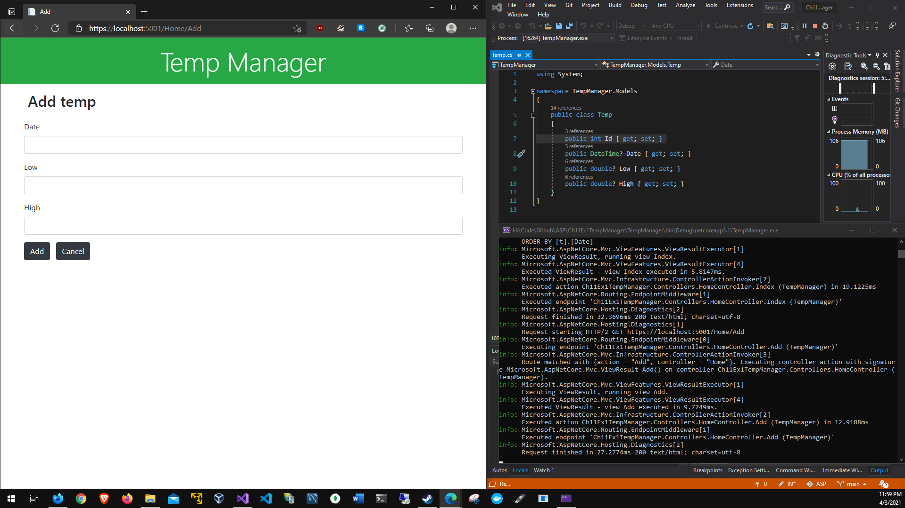
# Index showing a blank space:
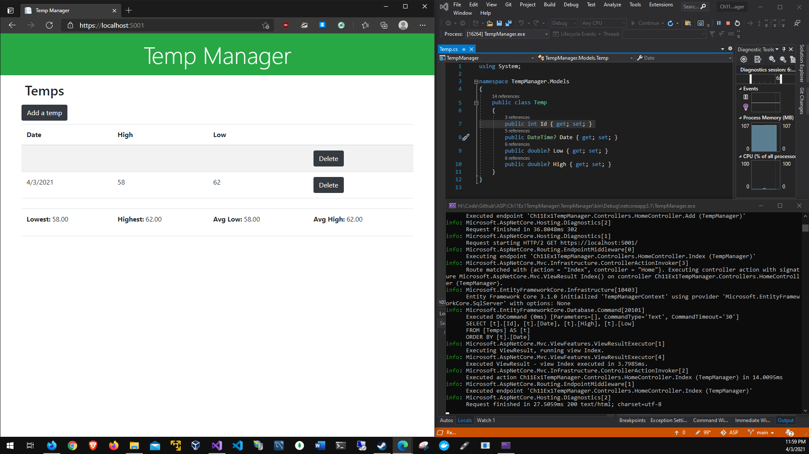
# Deleting blank data:
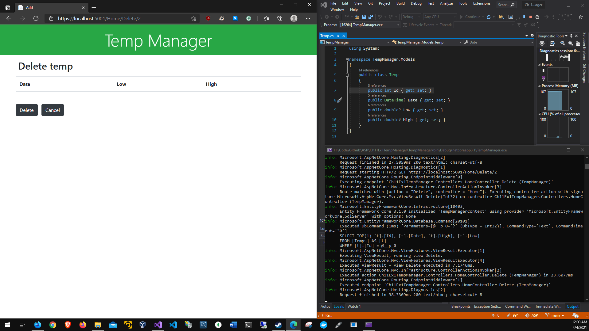
# Deleteing sample data:
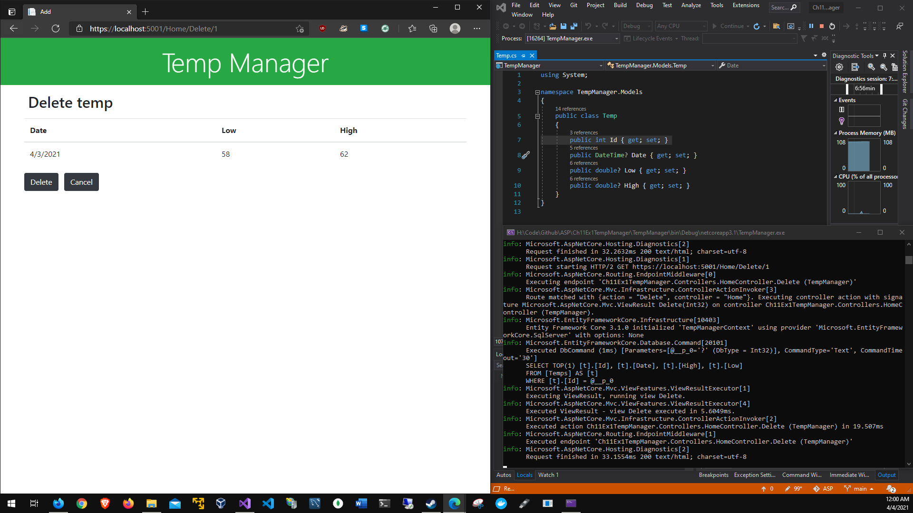
# Validation message without JavaScript:
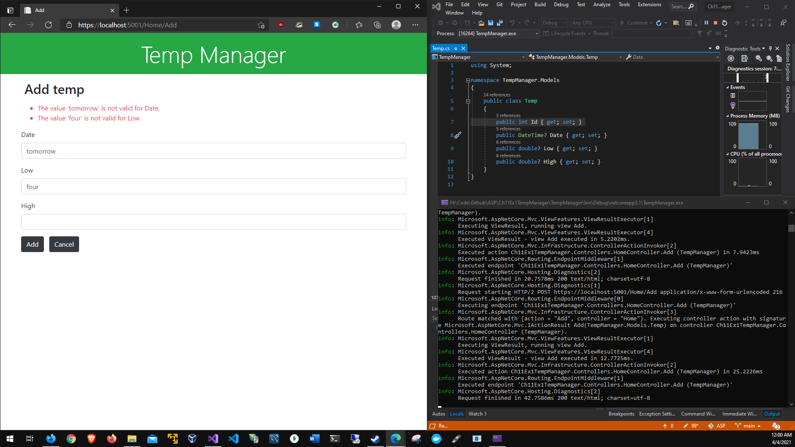
# Testing the validation with test data:
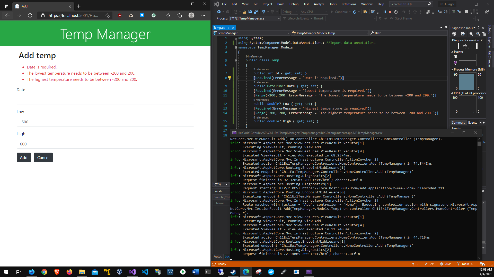
# Attempting to add a duplicate date:
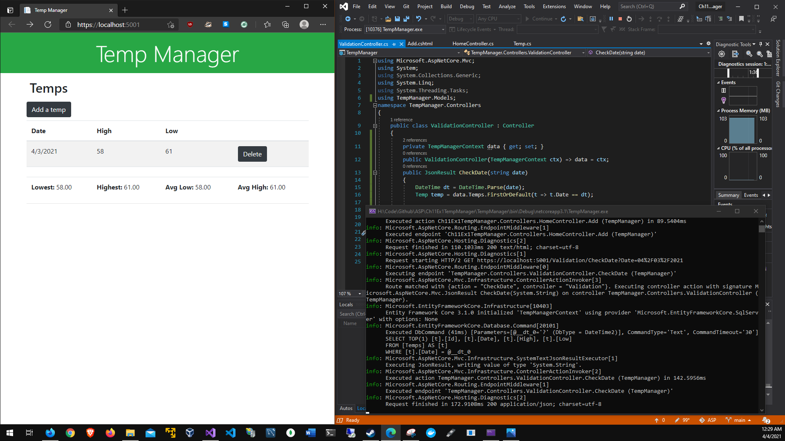
# Adding sample data that will be a duplicate date:
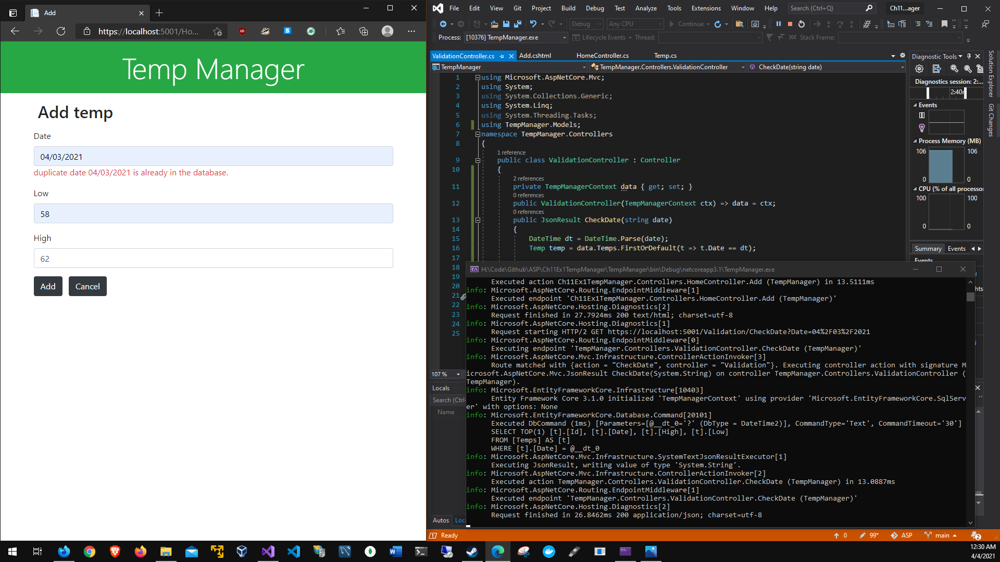
# Adding a duplicate date:

# Adding property level validation messages:
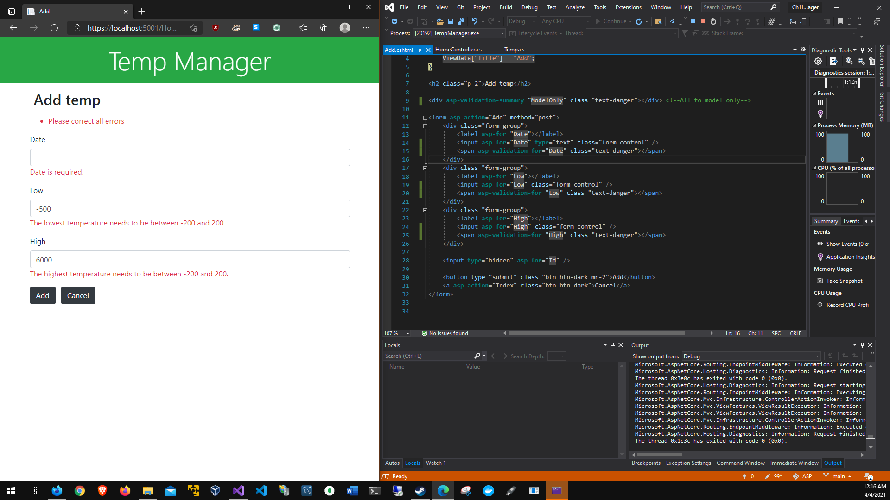
# Adding duplicate data with JavaScript disabled:
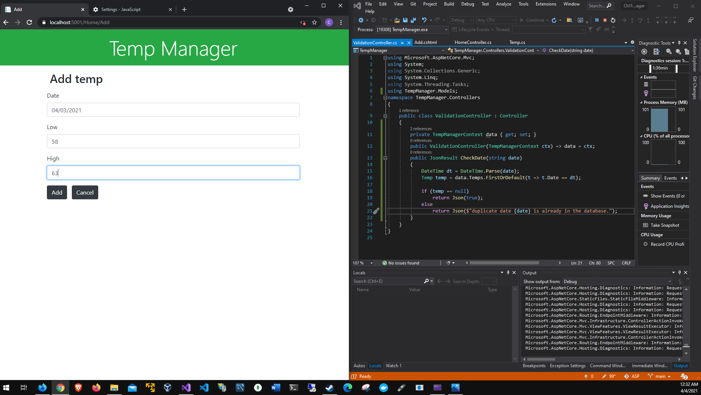
# Added duplicate data with JavaScript disabled:
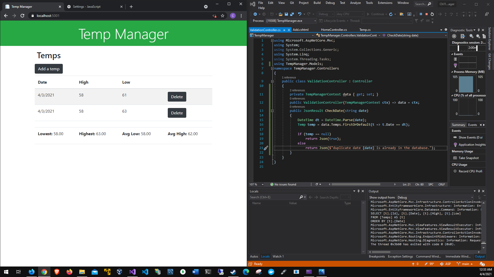
# JavaScript error because JavaScript is enabled:
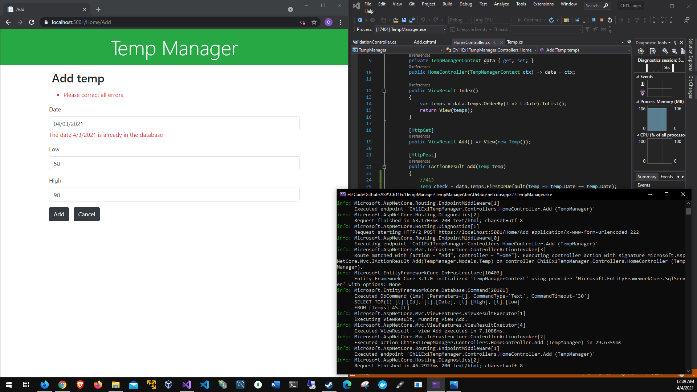
# Javascript not allowing duplicate data to be entered:
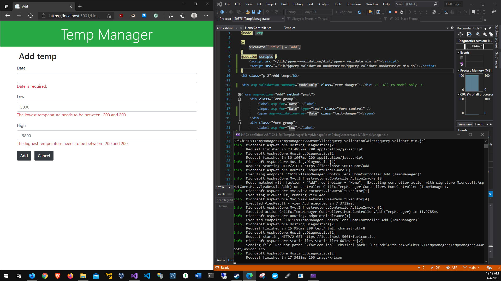
