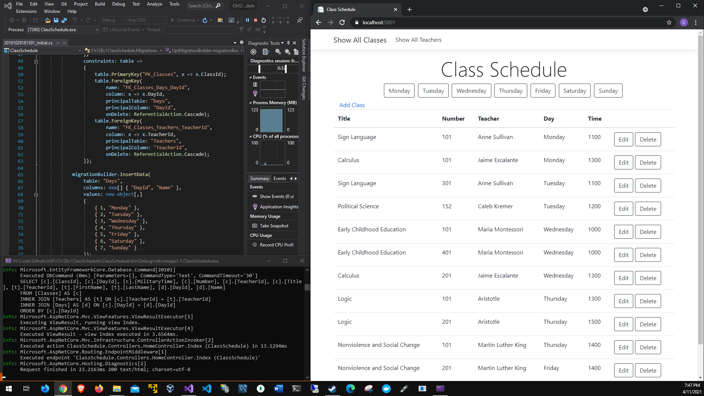
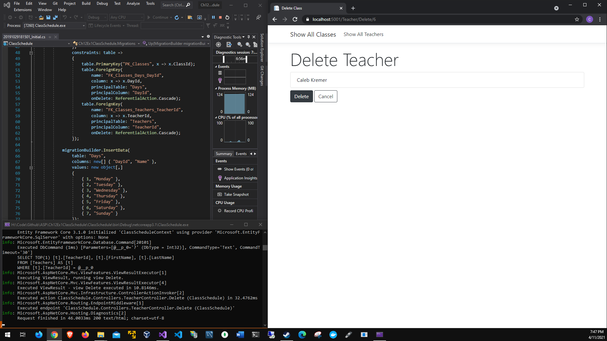

# Chapter 12 Class Schedule
# Phase 0: Testing the cascading behavior
# Application running:

# Update Database

# Add class:

# Added class:

# Add teacher:

# Added teacher:

# Delete Caleb:

# Phase 1: Restricting the cascading behavior and working with unit patterns
# Add Migrations

# Add class:

# Added class:

# Add teacher:

# Added teacher:

# Attempted to delete Error

# Error fix

# Unit test Index

# Unit test teachers

# Phase 2: List classes and overload
# Add class overload

# Add teacher overload

# Added class overload

# Delete class overload

# Delete teacher ovlerload

# Unordered time

# Ordered time by day(Monday)

# Ordered time Index

# Overload Add

# Overload Index

