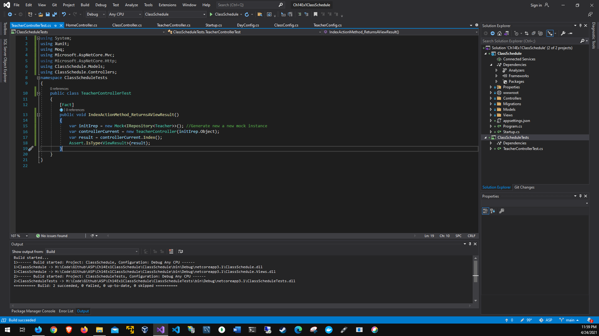

# Chapter 14 Dependency injection and unit testing
# Application running:

# Update database:

# Dependency injection Datalayer:

# Dependency injection HTTP Context Monday

# Dependency injection HTTP Context Edit

# Dependency injection HTTP Context remember Monday

# Adding a unit test:

# Building a unit test:

# Running the first unit test:

# Running both unit tests
