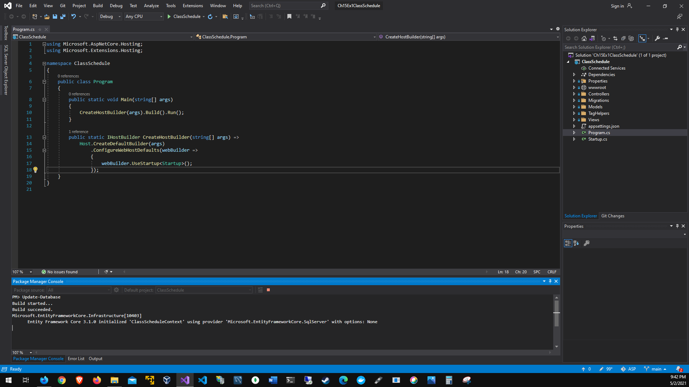
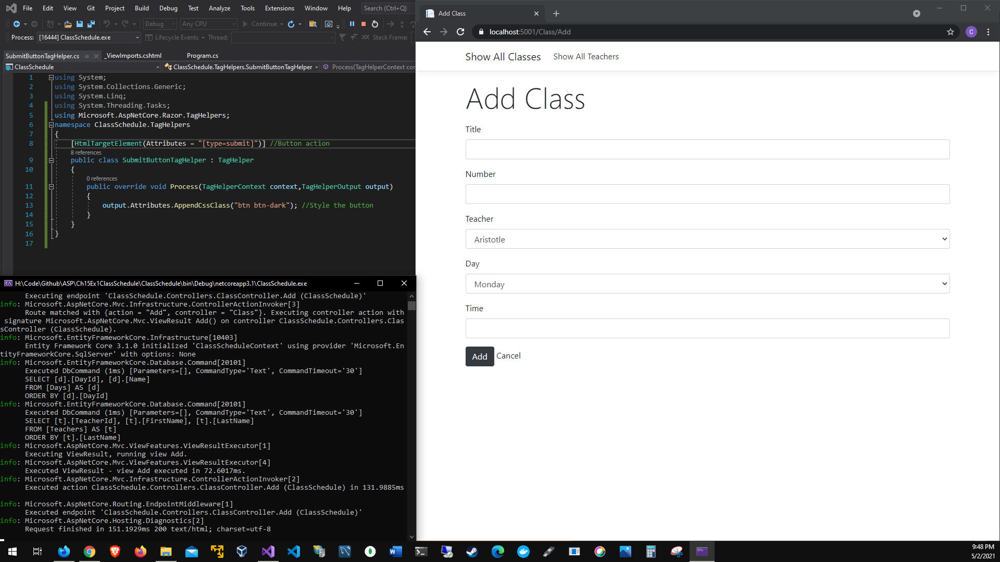

# Chapter 15 tag helpers, partial views, and view components
# Application running

# Update database

# No styling

# Add styling class

# Add styling teacher

# Is active

# Working link(Fixed the days)

# Day link check Monday

# Day link check Tuesday

# Day link check Wednesday

# Day link check Thursday

# Day link check Friday

# Day link check Saturday

# Day link check Sunday

# Day link select Monday

# Day link select Tuesday

# Day link select Wednesday

# Day link select Thursday

# Day link select Friday

# Day link select Saturday

# Day link select Sunday
