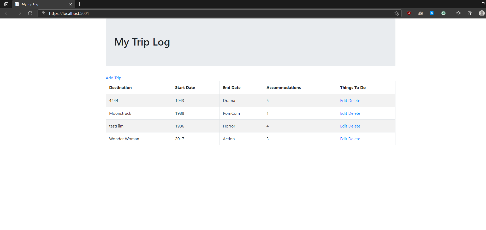
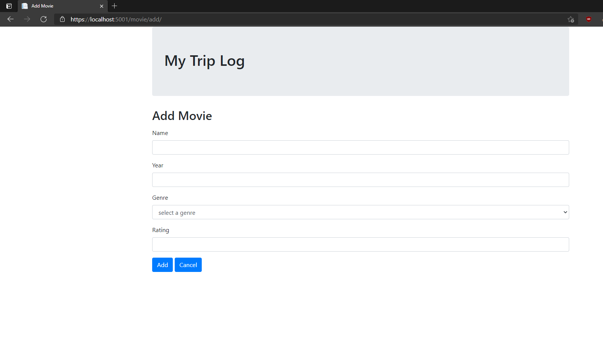
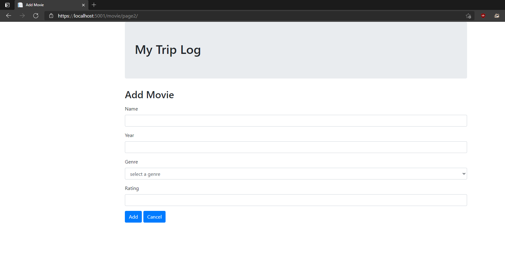
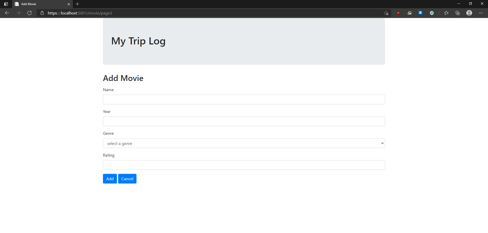
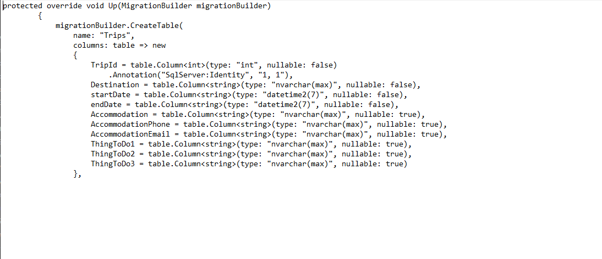

# Project 1
# Application running:

## I could not modify the forms because the data's objects were inaccessible. Visual Studio would not let me compile.
# Add page

# Add page 2

# Add page 3 (Returns to index)

# Up() Code

